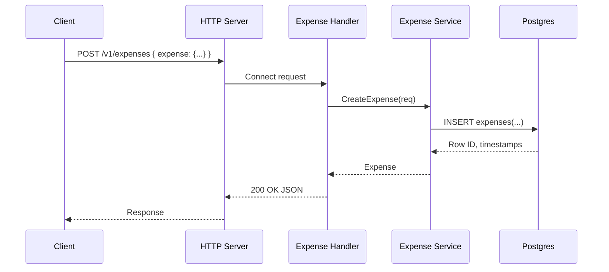

# APIs

This service exposes both REST and gRPC using Connect. REST routes are derived from google.api.http annotations in the proto files.

User API
- Register: POST `/v1/user:register` (body: RegisterRequest)
- Login: POST `/v1/user:login` (body: LoginRequest)

Payment API
- Make: POST `/v1/payment:make` (body: PaymentRequest)
- Mark Invoice Paid: POST `/v1/invoice:markPaid` (body: Invoice)
- Pay Invoice: POST `/v1/invoice:pay` (body: Invoice)

Expense API
- Create: POST `/v1/expenses` (body: CreateExpenseRequest)
- Get: GET `/v1/expenses/{id}`
- List: GET `/v1/expenses?user_id=<uuid>&page_size=<n>&page_token=<token>`
- Update: PATCH `/v1/expenses/{expense.id}` (body: UpdateExpenseRequest)
- Delete: DELETE `/v1/expenses/{id}` returns a timestamp

Common
- Health: GET `/livez`
- gRPC Reflection: enabled for Payment, UserService, ExpenseService

Sequence (Expense: Create)

Protobuf Style
- Enums use `_UNSPECIFIED = 0` and prefixed values.
- RPCs that perform actions use colon suffixes (e.g., `/resource:verb`).
- CRUD uses resource-oriented URIs for Expenses.

