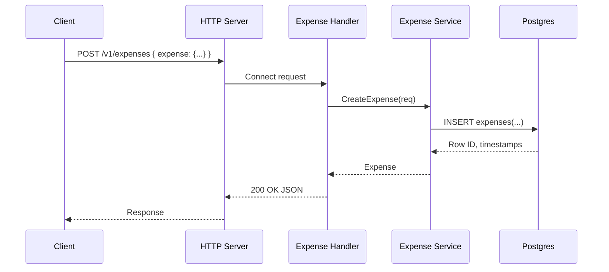

# APIs

This service exposes both REST and RPC using Connect.
Supported protocols:
- Connect (default, over HTTP/1.1 or HTTP/2)
- gRPC
- gRPC-Web

REST routes are derived from `google.api.http` annotations in the proto files.

Examples (Go):

```go
// Connect protocol (default)
client := paymentv1connect.NewPaymentClient(
    http.DefaultClient,
    "http://localhost:8080",
)
res, err := client.MakePayment(ctx, connect.NewRequest(&paymentv1.PaymentRequest{/*...*/}))

// gRPC
grpcClient := paymentv1connect.NewPaymentClient(
    http.DefaultClient,
    "http://localhost:8080",
    connect.WithGRPC(),
)

// gRPC-Web
webClient := userv1connect.NewUserServiceClient(
    http.DefaultClient,
    "http://localhost:8080",
    connect.WithGRPCWeb(),
)
```

Authenticated call with Bearer token (Connect)

```go
// After logging in and receiving an access token:
token := "<access_token>"

expClient := expensev1connect.NewExpenseServiceClient(
    http.DefaultClient,
    "http://localhost:8080",
)
req := connect.NewRequest(&expensev1.ListExpensesRequest{UserId: "<user-id>"})
req.Header().Set("Authorization", "Bearer "+token)
resp, err := expClient.ListExpenses(ctx, req)
if err != nil { /* handle */ }
fmt.Println("count:", len(resp.Msg.GetExpenses()))
```

User API
- Register: POST `/v1/user:register` (body: RegisterRequest)
- Login: POST `/v1/user:login` (body: LoginRequest)

Payment API
- Make: POST `/v1/payment:make` (body: PaymentRequest)
- Mark Invoice Paid: POST `/v1/invoice:markPaid` (body: Invoice)
- Pay Invoice: POST `/v1/invoice:pay` (body: Invoice)

Expense API
- Create: POST `/v1/expenses` (body: CreateExpenseRequest)
- Get: GET `/v1/expenses/{id}`
- List: GET `/v1/expenses?user_id=<uuid>&page_size=<n>&page_token=<token>`
- Update: PATCH `/v1/expenses/{expense.id}` (body: UpdateExpenseRequest)
- Delete: DELETE `/v1/expenses/{id}` returns a timestamp

Common
- Health: GET `/livez`
- gRPC Reflection: enabled for Payment, UserService, ExpenseService

Sequence (Expense: Create)



Protobuf Style
- Enums use `_UNSPECIFIED = 0` and prefixed values.
- RPCs that perform actions use colon suffixes (e.g., `/resource:verb`).
- CRUD uses resource-oriented URIs for Expenses.
