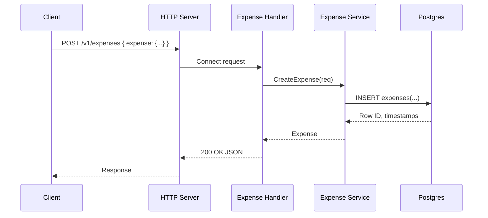

# APIs

This service exposes both REST and RPC using Connect.
Supported protocols:
- Connect (default, over HTTP/1.1 or HTTP/2)
- gRPC
- gRPC-Web

REST routes are derived from `google.api.http` annotations in the proto files.

Examples (Go):

```go
// Connect protocol (default)
client := paymentv1connect.NewPaymentServiceClient(
    http.DefaultClient,
    "http://localhost:8080",
)
res, err := client.MakePayment(ctx, connect.NewRequest(&paymentv1.PaymentRequest{/*...*/}))

// gRPC
grpcClient := paymentv1connect.NewPaymentServiceClient(
    http.DefaultClient,
    "http://localhost:8080",
    connect.WithGRPC(),
)

// gRPC-Web
webClient := userv1connect.NewUserServiceClient(
    http.DefaultClient,
    "http://localhost:8080",
    connect.WithGRPCWeb(),
)
```

Authenticated call with Bearer token (Connect)

```go
// After logging in and receiving an access token:
token := "<access_token>"

expClient := expensev1connect.NewExpenseServiceClient(
    http.DefaultClient,
    "http://localhost:8080",
)
req := connect.NewRequest(&expensev1.ListExpensesRequest{UserId: "<user-id>"})
req.Header().Set("Authorization", "Bearer "+token)
resp, err := expClient.ListExpenses(ctx, req)
if err != nil { /* handle */ }
fmt.Println("count:", len(resp.Msg.GetExpenses()))
```

## User API

Service: `rpc.user.v1.UserService`

### RegisterUser

Registers a new user.

- REST: `POST /v1/user:register`
- gRPC: `rpc.user.v1.UserService/RegisterUser`

**Request:** `rpc.user.v1.RegisterRequest`

| Field | Type | Description |
| :--- | :--- | :--- |
| `email` | `string` | Required |
| `password` | `string` | Required |
| `first_name` | `string` | |
| `last_name` | `string` | |

**Response:** `rpc.user.v1.RegisterResponse`

| Field | Type | Description |
| :--- | :--- | :--- |
| `id` | `string` | |
| `created_at` | `google.protobuf.Timestamp` | |

### LoginUser

Logs in a user and returns an access token.

- REST: `POST /v1/user:login`
- gRPC: `rpc.user.v1.UserService/LoginUser`

**Request:** `rpc.user.v1.LoginRequest`

| Field | Type | Description |
| :--- | :--- | :--- |
| `email` | `string` | Required |
| `password` | `string` | Required |

**Response:** `rpc.user.v1.LoginResponse`

| Field | Type | Description |
| :--- | :--- | :--- |
| `access_token` | `string` | |

## Payment API

Service: `rpc.payment.v1.PaymentService`

### MakePayment

Processes a payment.

- REST: `POST /v1/payment:make`
- gRPC: `rpc.payment.v1.PaymentService/MakePayment`

**Request:** `rpc.payment.v1.PaymentRequest`

| Field | Type | Description |
| :--- | :--- | :--- |
| `card_no` | `int64` | Card number |
| `card` | `rpc.payment.v1.CardType` | Card type |
| `name` | `string` | Card holder's name |
| `address_lines` | `repeated string` | Card holder's address |
| `amount` | `float` | Total payment amount |
| `payment_created` | `google.protobuf.Timestamp` | Timestamp for when the payment was created |

**Response:** `rpc.payment.v1.PaymentResponse`

| Field | Type | Description |
| :--- | :--- | :--- |
| `status` | `rpc.payment.v1.PaymentStatus` | |
| `error` | `string` | Payment error message (if any) |

### MarkInvoicePaid

Marks an invoice as paid.

- REST: `POST /v1/invoice:markPaid`
- gRPC: `rpc.payment.v1.PaymentService/MarkInvoicePaid`

**Request:** `rpc.payment.v1.Invoice`

| Field | Type | Description |
| :--- | :--- | :--- |
| `id` | `int64` | Unique identifier for the invoice |
| `invoice_name` | `string` | Invoice name |
| `amount` | `google.type.Money` | Invoice amount |
| `paid` | `bool` | Indicates if the invoice is paid |

**Response:** `rpc.payment.v1.Invoice`

### PayInvoice

Pays an invoice.

- REST: `POST /v1/invoice:pay`
- gRPC: `rpc.payment.v1.PaymentService/PayInvoice`

**Request:** `rpc.payment.v1.Invoice`

**Response:** `rpc.payment.v1.Invoice`

## Expense API

Service: `rpc.expense.v1.ExpenseService`

### CreateExpense

Creates a new expense.

- REST: `POST /v1/expenses`
- gRPC: `rpc.expense.v1.ExpenseService/CreateExpense`

**Request:** `rpc.expense.v1.CreateExpenseRequest`

| Field | Type | Description |
| :--- | :--- | :--- |
| `expense` | `rpc.expense.v1.Expense` | Required: user_id, amount |

**Response:** `rpc.expense.v1.Expense`

### GetExpense

Retrieves an expense by its ID.

- REST: `GET /v1/expenses/{id}`
- gRPC: `rpc.expense.v1.ExpenseService/GetExpense`

**Request:** `rpc.expense.v1.GetExpenseRequest`

| Field | Type | Description |
| :--- | :--- | :--- |
| `id` | `string` | Required |

**Response:** `rpc.expense.v1.Expense`

### ListExpenses

Lists expenses, with optional filtering by user.

- REST: `GET /v1/expenses`
- gRPC: `rpc.expense.v1.ExpenseService/ListExpenses`

**Request:** `rpc.expense.v1.ListExpensesRequest`

| Field | Type | Description |
| :--- | :--- | :--- |
| `user_id` | `string` | Optional filter by user |
| `page_size` | `int32` | |
| `page_token` | `string` | |

**Response:** `rpc.expense.v1.ListExpensesResponse`

| Field | Type | Description |
| :--- | :--- | :--- |
| `expenses` | `repeated rpc.expense.v1.Expense` | |
| `next_page_token` | `string` | |

### UpdateExpense

Updates an existing expense.

- REST: `PATCH /v1/expenses/{expense.id}`
- gRPC: `rpc.expense.v1.ExpenseService/UpdateExpense`

**Request:** `rpc.expense.v1.UpdateExpenseRequest`

| Field | Type | Description |
| :--- | :--- | :--- |
| `expense` | `rpc.expense.v1.Expense` | Must include id |
| `update_mask` | `google.protobuf.FieldMask` | |

**Response:** `rpc.expense.v1.Expense`

### DeleteExpense

Deletes an expense.

- REST: `DELETE /v1/expenses/{id}`
- gRPC: `rpc.expense.v1.ExpenseService/DeleteExpense`

**Request:** `rpc.expense.v1.DeleteExpenseRequest`

| Field | Type | Description |
| :--- | :--- | :--- |
| `id` | `string` | Required |

**Response:** `google.protobuf.Timestamp`


Common
- Health: GET `/livez`
- gRPC Reflection: enabled for PaymentService, UserService, ExpenseService

Sequence (Expense: Create)



Protobuf Style
- Enums use `_UNSPECIFIED = 0` and prefixed values.
- RPCs that perform actions use colon suffixes (e.g., `/resource:verb`).
- CRUD uses resource-oriented URIs for Expenses.
