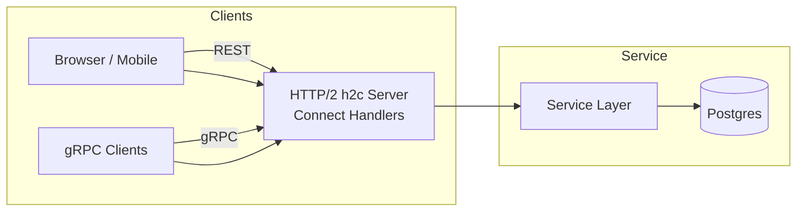
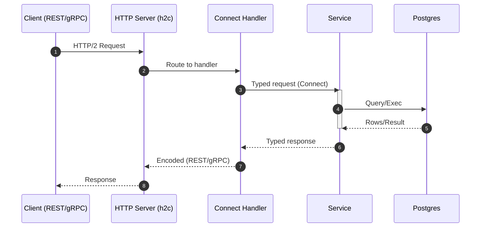
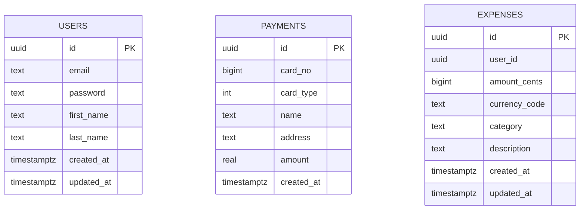

# Architecture

This service exposes dual-protocol APIs (gRPC and REST) using Connect over a single HTTP/2 h2c port. It persists to PostgreSQL and ships with docker/compose for local and CI.

High-level

Request Flow

Components
- Connect Handlers: `internal/transport/http/handler.go` wires service implementations to HTTP mux; also serves health and reflection.
- Service Layer: `internal/service` provides interfaces; implementations delegate to the datastore.
- Datastore (pgx pool): `internal/postgres` with embedded migrations and query methods.
- Configuration: `internal/config` (envconfig) loads YAML + env overrides.
- Auth & Rate Limit: `internal/security` and `internal/transport/middleware/*`.

Data Model (partial)

Ports & Protocols
- App: HTTP/2 h2c on port 8080 (gRPC + REST via Connect)
