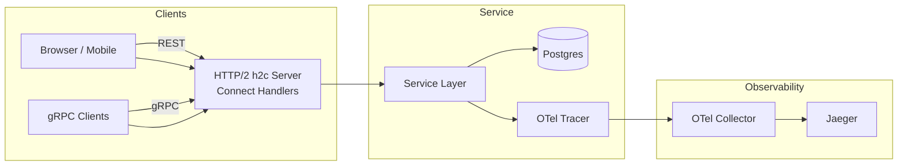
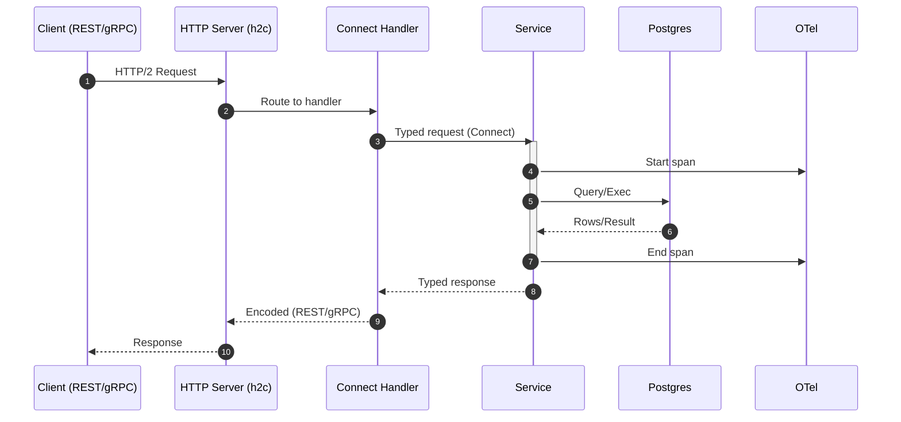
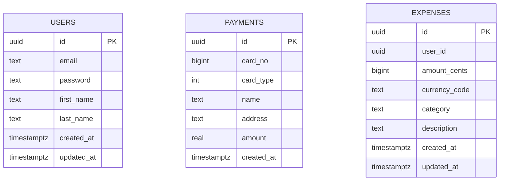

# Architecture

This service exposes dual-protocol APIs (gRPC and REST) using Connect over a single HTTP/2 h2c port. It persists to PostgreSQL, ships traces to an OTel collector (Jaeger by default in docker-compose), and is containerized for Cloud Run.

High-level

Request Flow

Components
- Connect Handlers: `cmd/server/handler.go` wires service implementations to HTTP mux; also serves health and reflection.
- Service Layer: `internal/service` provides interfaces; implementations delegate to the datastore.
- Datastore (pgx pool): `internal/postgres` with embedded migrations and query methods.
- Configuration: `internal/config` (Koanf) loads YAML + env overrides and exports envs for compatibility.
- Observability: `internal/logz` creates an OTLP exporter; handlers add OTel middleware.

Data Model (partial)

Ports & Protocols
- App: HTTP/2 h2c on port 8080 (gRPC + REST via Connect)
- OTel gRPC exporter: default `otel-collector:4317`

